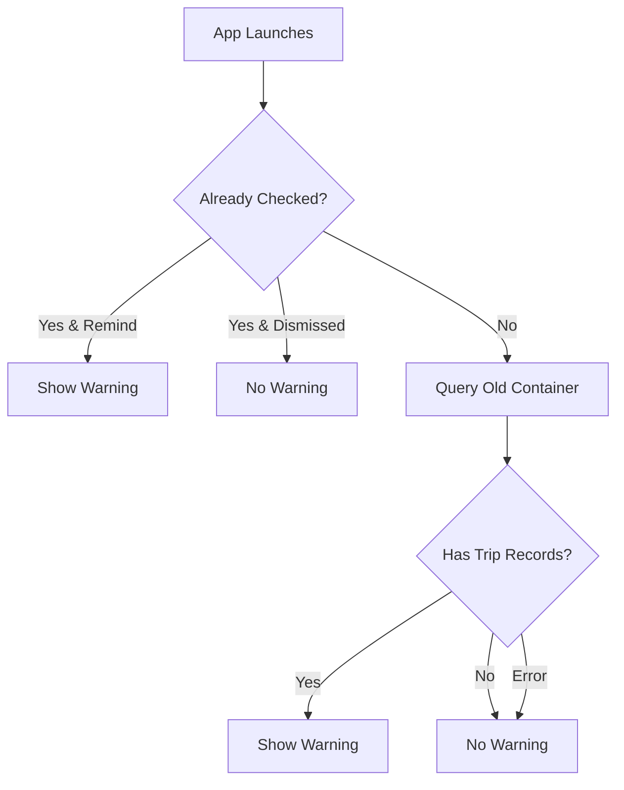

# Container Migration Warning Implementation

## Overview
The app intelligently detects if users have data in the OLD iCloud container (`iCloud.com.jkadans.ProPilotApp`) and only shows the migration warning to those users. New users and users already on the new container won't see the warning.

## 🎯 Smart Detection Logic

### Container Detection:
```swift
OLD Container: "iCloud.com.jkadans.ProPilotApp"
NEW Container: "iCloud.com.jkadans.TheProPilotApp"
```

### Who Sees the Warning:
✅ **Users WITH data in OLD container** - Shows warning
❌ **New users (no data in OLD container)** - No warning  
❌ **Users already migrated** - No warning
❌ **Users not signed into iCloud** - No warning

### Detection Process:
1. App launches
2. Checks if user already dismissed warning
3. If not, queries OLD container for Trip records
4. If Trip records found → Show warning
5. If no records found → Skip warning
6. Result cached to avoid repeated checks

## ✅ What's Been Implemented

### 1. Migration Warning Manager
**File: `ContainerMigrationWarning.swift`**

Enhanced manager with CloudKit detection:

```swift
MigrationWarningManager.shared
- shouldShowWarning: Bool (Published)
- isCheckingContainer: Bool (Published)
- checkForOldContainer() → Async check
- hasDataInOldContainer() → Queries old container
```

**Detection Method:**
```swift
private func hasDataInOldContainer() async -> Bool {
    // Query OLD container for ANY Trip record
    // Returns true if data exists, false otherwise
    // Handles all CloudKit errors gracefully
}
```

**UserDefaults Keys:**
- `HasShownContainerMigrationWarning` - Warning was shown
- `RemindAboutContainerMigration` - User wants reminder
- `HasCheckedOldContainer` - Already checked (cache result)

### Error Handling:
The system gracefully handles all CloudKit errors:
- **Not authenticated** → No warning (assume new user)
- **Network unavailable** → No warning (don't bother user)
- **Permission failure** → No warning (never used old container)
- **Other errors** → No warning (fail gracefully)

## 🔍 Detection Flow



## 📱 User Experience Scenarios

### Scenario 1: Existing User with Data
```
User: Has trips in old container
Detection: ✅ Finds records in old container
Result: Shows full migration warning
Action: User backs up and migrates
```

### Scenario 2: New User
```
User: Fresh install, no previous data
Detection: ❌ No records in old container
Result: No warning shown
Action: User continues normally
```

### Scenario 3: Already Migrated User
```
User: Already migrated, has data in NEW container
Detection: ❌ No records in old container (already moved)
Result: No warning shown
Action: User continues normally
```

### Scenario 4: Offline User
```
User: Not connected to internet
Detection: ❌ Network error checking container
Result: No warning shown (fail gracefully)
Action: User continues, will check next launch if online
```

### Scenario 5: No iCloud Account
```
User: Not signed into iCloud
Detection: ❌ Not authenticated error
Result: No warning shown
Action: User continues (never used iCloud)
```

### 2. Full-Screen Warning View
**`ContainerMigrationWarningView`**

Comprehensive modal that shows:
- ⚠️ Large warning icon
- Clear explanation of the situation
- Step-by-step backup instructions
- Direct link to Backup & Restore
- Two action buttons:
  - "I Understand - Continue" (dismisses permanently)
  - "Remind Me Next Launch" (shows again next time)

**Features:**
- Cannot be dismissed by swipe (`.interactiveDismissDisabled`)
- Clear visual hierarchy with color-coded sections
- Direct navigation to backup tools

### 3. Compact Banner Version
**`ContainerMigrationBanner`**

Smaller banner for inline display (optional):
- Shows at top of screen
- Can be dismissed
- "Learn More" button opens full warning
- "Remind Later" keeps banner showing

### 4. Settings Link
**`MigrationWarningSettingsRow`**

Added to Backup & Restore settings:
- Orange warning icon
- "Container Migration Info" row
- Tappable to view full instructions
- Always accessible even after dismissing

## 🎯 Integration Points

### ContentView.swift
```swift
// Added state management
@StateObject private var migrationManager = MigrationWarningManager.shared
@State private var showingMigrationWarning = false

// Added in onAppear
if migrationManager.shouldShowWarning {
    DispatchQueue.main.asyncAfter(deadline: .now() + 0.5) {
        showingMigrationWarning = true
    }
}

// Added sheet
.sheet(isPresented: $showingMigrationWarning) {
    ContainerMigrationWarningView()
}
```

### DataBackupSettingsView.swift
```swift
// Added at top of settings
MigrationWarningSettingsRow()
```

## 📱 User Experience Flow

### First Launch Scenario:
1. User opens app with new container
2. After 0.5s delay, full-screen warning appears
3. User reads instructions
4. User has two choices:
   - **"I Understand"** → Warning dismissed, won't show again
   - **"Remind Me Next Launch"** → Warning will show again next time

### Subsequent Launches:
- If user chose "Remind Me": Warning shows again
- If user chose "I Understand": No warning shown
- User can always access warning from Settings → Backup & Restore

### Backup Flow:
1. User taps "Go to Backup & Restore Now" in warning
2. Opens DataBackupSettingsView directly
3. User can create backup
4. Returns to warning, chooses "I Understand"

## 🎨 Visual Design

### Color Coding:
- 🟠 Orange: Main warning color
- 🔵 Blue: Information sections
- 🟢 Green: Action required
- 🟣 Purple: Backup instructions
- 🔵 Indigo: Restore instructions

### Layout Structure:
```
┌─────────────────────────────────────┐
│   ⚠️  Warning Icon (Orange)          │
│   "Important: Data Migration..."    │
├─────────────────────────────────────┤
│   📜 Scrollable Content:             │
│   • Main Warning (Orange box)       │
│   • What This Means (Blue box)      │
│   • Action Required (Green box)     │
│   • How to Backup (Purple box)      │
│   • How to Restore (Indigo box)     │
├─────────────────────────────────────┤
│   🔘 "I Understand" (Blue)           │
│   🔘 "Remind Me Next Launch" (Gray)  │
└─────────────────────────────────────┘
```

## 🔧 Customization

### Changing Container Identifier:
```swift
private let currentContainerIdentifier = "iCloud.com.jkadans.TheProPilotApp"
```

### Changing When Warning Shows:
```swift
// Show only once
manager.markWarningShown(remindNext: false)

// Show every time until dismissed
manager.markWarningShown(remindNext: true)

// Reset to show again
manager.resetWarning()
```

### Adding Custom Actions:
```swift
// In ContainerMigrationWarningView
Button("Custom Action") {
    // Your action here
    manager.markWarningShown(remindNext: false)
    dismiss()
}
```

## 📝 Key Messages Shown

### Main Warning:
"This version uses a new iCloud container. Your existing data will NOT automatically transfer to this version."

### What This Means:
- Old data remains in previous version
- New version starts fresh
- Must backup before uninstalling old version
- Backups can be restored to new version

### Action Required:
1. Keep old app installed
2. Open old version and create backup
3. Save backup file
4. Then safely delete old version

## 🔒 Privacy & Safety

### Data Protection:
- Warning prevents accidental data loss
- Users must explicitly acknowledge
- Cannot be accidentally dismissed
- Always accessible from settings

### User Control:
- Can choose to see again
- Can dismiss permanently
- Can review anytime from settings
- Direct link to backup tools

## 🧪 Testing Checklist

### First Launch:
- [ ] Warning appears after 0.5s delay
- [ ] Cannot be dismissed by swipe
- [ ] Both buttons work correctly
- [ ] "Remind Me" shows warning again

### Settings Access:
- [ ] Row appears in Backup & Restore
- [ ] Tapping opens full warning
- [ ] Warning can be dismissed from there

### State Persistence:
- [ ] "I Understand" prevents future warnings
- [ ] "Remind Me" shows warning next launch
- [ ] State survives app restart

### Visual Testing:
- [ ] Layout looks correct on iPhone
- [ ] Layout looks correct on iPad
- [ ] Colors render correctly
- [ ] Icons display properly

## 🚀 Deployment Notes

### When to Show Warning:
- Show for ANY update that changes container
- Show for fresh installs (optional)
- Don't show if container hasn't changed

### App Store Description:
```
IMPORTANT UPDATE NOTICE:
This version uses a new iCloud container for improved reliability. 
Please create a backup of your data BEFORE updating if you want to 
preserve your existing logbook. Backup and restore instructions are 
provided in the app.
```

### Support Documentation:
Create help article with:
- Why the container changed
- How to backup data
- How to restore data
- What happens to old data
- FAQ section

## 📊 Analytics (Optional)

Track user behavior:
```swift
// When warning is shown
Analytics.track("migration_warning_shown")

// When user dismisses
Analytics.track("migration_warning_dismissed", properties: [
    "remind_later": remindNext
])

// When user goes to backup
Analytics.track("migration_backup_clicked")
```

## 🔄 Future Improvements

### Possible Enhancements:
1. **Auto-backup reminder**: Schedule notification if user hasn't backed up
2. **Version detection**: Only show warning if coming from specific old version
3. **Export button**: Add direct export button in warning
4. **Progress indicator**: Show backup progress in warning
5. **Migration wizard**: Step-by-step guided process

### Example Auto-Backup Check:
```swift
func checkBackupStatus() {
    let lastBackup = UserDefaults.standard.object(forKey: "lastBackupDate") as? Date
    if lastBackup == nil || daysSince(lastBackup!) > 30 {
        // Show more urgent warning
        showingBackupPrompt = true
    }
}
```

## 📱 Screenshots for App Store

Recommended screenshots showing:
1. Warning screen with clear message
2. Backup instructions highlighted
3. Backup & Restore screen
4. Successful restore confirmation

## ✅ Summary

**Files Modified:**
- ContentView.swift (added warning trigger)
- DataBackupSettingsView.swift (added settings link)

**Files Created:**
- ContainerMigrationWarning.swift (complete implementation)

**User Impact:**
- Clear communication about migration
- Prevents accidental data loss
- Easy access to backup tools
- Can't be accidentally dismissed

**Result:** Users are properly warned and guided through the container migration process, preventing data loss and support issues.
